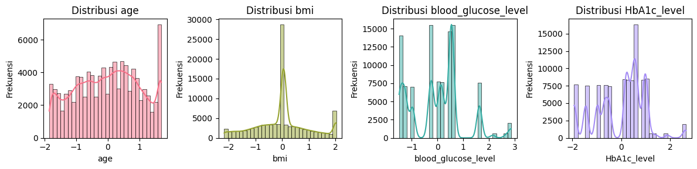
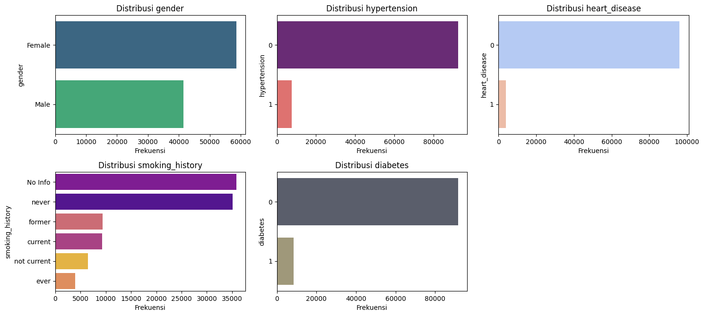
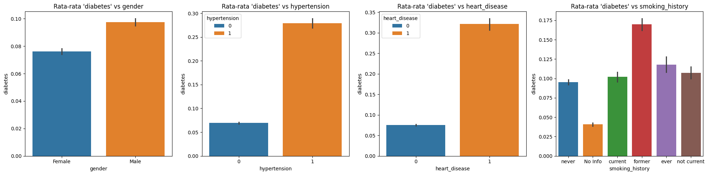
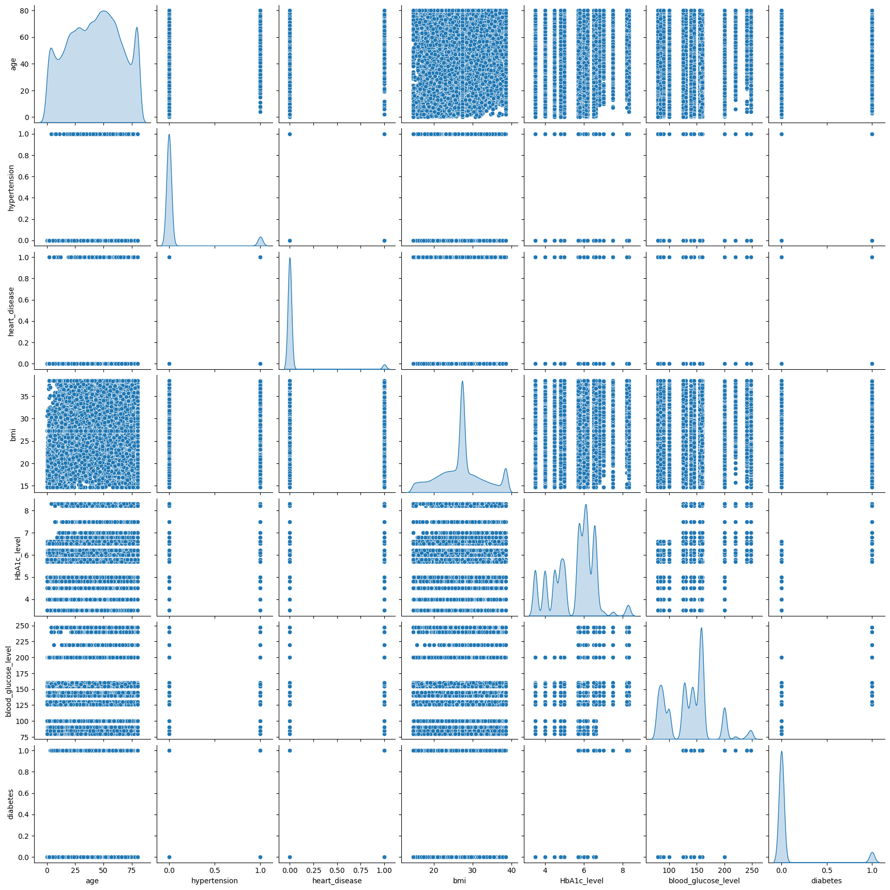
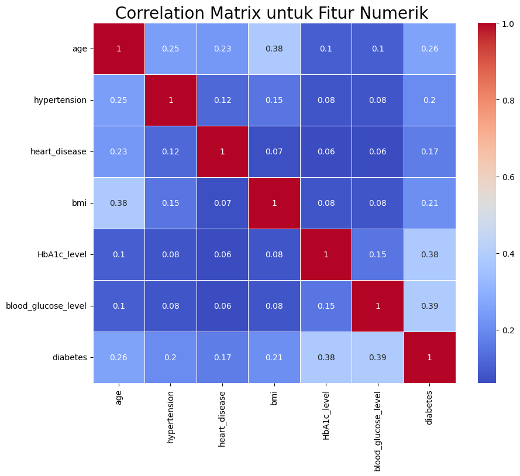

# Laporan Proyek Machine Learning - Ferri Krisdiantoro

## Domain Proyek

**[Menurut Lopana et al (2007)](https://www.tandfonline.com/doi/abs/10.1163/156939307783239429)**, Diabetes merupakan penyakit kronis yang umum dan menjadi ancaman besar bagi kesehatan manusia. Ciri khas diabetes adalah kadar glukosa darah yang lebih tinggi dari kadar normal, yang disebabkan oleh sekresi insulin yang tidak sempurna atau efek biologisnya yang terganggu, atau keduanya. Diabetes juga merupakan sebuah penyakit kronis yang sangat berbahaya dan terus meningkat setiap tahunnya di seluruh belahan dunia. Penyakit mematikan ini dapat menyebabkan berbagai macam penyakit dan komplikasi serius yang diantaranya ialah gagal ginjal, penyakit jantung, dan kerusakan saraf jika tidak didiagnosis dan tidak ditangani dengan baik secepatnya. Dengan demikian, memprediksi penyakit diabetes lebih dini itu sangatlah penting untuk membantu mengambil langkah pencegahan dan perawatan lebih awal.

Menurut penelitian yang dilakukan oleh **[Digliati et al. (2017)](https://journals.sagepub.com/doi/full/10.1177/1932296817706375)**, machine learning telah digunakan dalam analisis data medis untuk mengembangkan model prediktif komplikasi diabetes tipe 2 berbasis data rekam medis elektronik. Studi ini menggunakan pipeline data mining yang mencakup profil klinis pasien, konstruksi model prediktif, serta validasi model. Dengan menangani data yang hilang menggunakan Random Forest dan menerapkan regresi logistik dengan pemilihan fitur bertahap, penelitian ini berhasil membangun model prediksi komplikasi seperti retinopati, neuropati, dan nefropati dengan akurasi hingga 0,838 dalam rentang waktu 3, 5, dan 7 tahun sejak kunjungan pertama pasien ke pusat diabetes. Variabel yang dipertimbangkan meliputi jenis kelamin, usia, indeks massa tubuh (BMI), hemoglobin terglikasi (HbA1c), hipertensi, serta kebiasaan merokok, yang disesuaikan dengan jenis komplikasi dan skenario waktu tertentu untuk mempermudah penerapan dalam praktik klinis.

Selain itu, penelitian yang dilakukan oleh **[Zou et al. (2018)](https://www.frontiersin.org/journals/genetics/articles/10.3389/fgene.2018.00515/full#B57)** membahas penerapan algoritma machine learning seperti Decision Tree, Random Forest, dan Neural Network dalam memprediksi diabetes mellitus. Studi ini menggunakan data pemeriksaan fisik rumah sakit di Luzhou, China, dengan 14 atribut kesehatan. Untuk mengatasi ketidakseimbangan data, dilakukan ekstraksi data secara acak sebanyak lima kali, dan hasilnya dirata-ratakan. Metode reduksi dimensi seperti Principal Component Analysis (PCA) dan Minimum Redundancy Maximum Relevance (mRMR) diterapkan untuk meningkatkan kinerja model. Hasil penelitian menunjukkan bahwa algoritma Random Forest mencapai akurasi tertinggi sebesar 0,8084 ketika semua atribut digunakan, menunjukkan efektivitas pendekatan ini dalam prediksi diabetes berdasarkan data kesehatan.

Berdasarkan penelitian tersebut, penggunaan machine learning dalam prediksi diabetes menjadi solusi yang potensial untuk meningkatkan efisiensi deteksi dini serta membantu pasien dalam pengambilan keputusan terkait gaya hidup dan perawatan medis. Deteksi dini diabetes sangat penting untuk mengurangi risiko komplikasi jangka panjang dan biaya pengobatan yang tinggi. Dengan adanya model prediksi berbasis machine learning, tenaga medis dapat memberikan diagnosis yang lebih cepat dan akurat, serta merekomendasikan tindakan pencegahan yang lebih efektif kepada pasien berisiko tinggi. Selain itu, prediksi berbasis data dapat membantu meningkatkan kesadaran masyarakat mengenai faktor risiko diabetes, sehingga mendorong perubahan gaya hidup yang lebih sehat. Oleh karena itu, implementasi model prediksi diabetes yang andal dapat memberikan manfaat besar bagi individu maupun sistem kesehatan secara keseluruhan.

## Business Understanding

### Problem Statements
1. Bagaimana cara memprediksi kemungkinan seorang mengidap diabeter berdasarkan fakto-faktor kesehatan yang dialami?
2. Seberapa akurat model dapat memprediksi dibandingkan dengan metode konvensional dalam mendeteksi diabetes?

### Goals
1. Mengembangkan sebuah model machine learning untuk memprediksi kemungkinan seseorang mengidap penyakit diabetes berdasarkan faktor-faktor kesehatan yang dialami.
2. Mengevaluasi kinerja model Machine Learning dengan berbagai metrik evaluasi seperti akurasi, precision, recall, F1-score, dan confusion matrix, guna memastikan model memiliki performa yang optimal dalam mendeteksi diabetes.

### Solution Statement
1. Menggunakan beberapa algoritma Machine Learning seperti Random Forest, XGBoost, dan LightGBM untuk membandingkan performa model dalam mendeteksi diabetes.
2. Melakukan analisis hasil model berdasarkan metrik evaluasi untuk memilih model terbaik yang mampu memberikan prediksi paling akurat.

## Data Understanding
**`Diabetes prediction dataset`** merupakan kumpulan data medis dan demografi dari pasien, beserta status diabetes mereka (positif atau negatif). Data tersebut mencakup fitur-fitur seperti usia, jenis kelamin, indeks massa tubuh (IMT/BMI), hipertensi, penyakit jantung, riwayat merokok, kadar HbA1c, dan kadar glukosa darah. Dataset berjumlah 19 kolom, 100000 baris dan dataset bersih tidak ada missing values, dataset ini diambil dari platform **[Kaggle](https://www.kaggle.com/datasets/iammustafatz/diabetes-prediction-dataset)**.

### Variabel-variabel pada Diabetes prediction dataset adalah sebagai berikut:
- **`gender`** : Jenis kelamin mengacu pada jenis kelamin biologis seseorang, yang dapat memengaruhi kerentanan mereka terhadap diabetes. Ada tiga kategori di dalamnya: laki-laki, perempuan, dan lainnya.
- **`age`** : Usia merupakan faktor penting karena diabetes lebih umum didiagnosis pada orang dewasa yang lebih tua. Usia berkisar antara 0-80 dalam kumpulan data kami.
- **`hypertension`** : Hipertensi adalah kondisi medis di mana tekanan darah di arteri terus meningkat. Nilainya 0 atau 1, di mana 0 menunjukkan mereka tidak memiliki hipertensi dan 1 berarti mereka memiliki hipertensi.
- **`heart_disease`** : Penyakit jantung adalah kondisi medis lain yang dikaitkan dengan peningkatan risiko terkena diabetes. Nilainya 0 atau 1, di mana 0 menunjukkan mereka tidak memiliki penyakit jantung dan 1 berarti mereka memiliki penyakit jantung.
- **`smoking_history`** : Riwayat merokok juga dianggap sebagai faktor risiko diabetes dan dapat memperburuk komplikasi yang terkait dengan diabetes. Dalam kumpulan data kami, kami memiliki 5 kategori, yaitu tidak saat ini, sebelumnya, Tidak Ada Informasi, saat ini, tidak pernah, dan pernah.
- **`bmi`** : BMI (Indeks Massa Tubuh) adalah ukuran lemak tubuh berdasarkan berat dan tinggi badan. Nilai BMI yang lebih tinggi dikaitkan dengan risiko diabetes yang lebih tinggi. Kisaran BMI dalam kumpulan data adalah dari 10,16 hingga 71,55. BMI kurang dari 18,5 berarti kekurangan berat badan, 18,5-24,9 berarti normal, 25-29,9 berarti kelebihan berat badan, dan 30 atau lebih berarti obesitas.
- **`HbA1c_level`** : Kadar HbA1c (Hemoglobin A1c) adalah ukuran kadar gula darah rata-rata seseorang selama 2-3 bulan terakhir. Kadar yang lebih tinggi menunjukkan risiko lebih besar terkena diabetes. Umumnya, lebih dari 6,5% Kadar HbA1c menunjukkan diabetes.
- **`blood_glucose_level`** : Kadar glukosa darah mengacu pada jumlah glukosa dalam aliran darah pada waktu tertentu. Kadar glukosa darah yang tinggi merupakan indikator utama diabetes.
- **`diabetes`** : Diabetes adalah variabel target yang diprediksi, dengan nilai 1 menunjukkan keberadaan diabetes dan 0 menunjukkan tidak adanya diabetes.

### Visualisasi Distribusi Data Numerik
Visualisasi distribusi variabel menunjukkan bahwa **age** memiliki sebaran yang relatif normal dengan sedikit skew di ujung kanan, **bmi** memiliki distribusi yang sangat tidak merata dengan puncak yang tajam di sekitar nol, **blood_glucose_level** menunjukkan distribusi multimodal dengan beberapa puncak, sementara **HbA1c_level** juga menunjukkan pola yang serupa dengan banyak puncak dan distribusi yang tidak merata.



### Visualisasi Distribusi Data Kategori
Visualisasi distribusi data kategori menunjukkan bahwa jumlah individu **perempuan** lebih banyak dibandingkan laki-laki, mayoritas sampel **tidak memiliki hipertensi, penyakit jantung, maupun diabetes**, dengan hanya sebagian kecil yang terdiagnosis. Dalam riwayat merokok, kategori "No Info" dan "Never" mendominasi, sementara kategori "Former", "Current", "Not Current", dan "Ever" memiliki jumlah yang jauh lebih sedikit.



### Visualisasi Rata Rata Diabetes vs Fitur
Visualisasi menunjukkan bahwa laki-laki memiliki rata-rata diabetes lebih tinggi daripada perempuan. Individu dengan hipertensi dan penyakit jantung memiliki kemungkinan lebih tinggi menderita diabetes. Riwayat merokok juga berpengaruh, dengan mantan perokok memiliki rata-rata diabetes tertinggi, sementara kategori "No Info" memiliki yang terendah.



### Visualisasi KDE
Visualisasi menunjukkan hubungan antara berbagai fitur dalam dataset, seperti **age, hypertension, heart_disease, bmi, HbA1c_level, blood_glucose_level**, dan **diabetes**. Scatter plot memperlihatkan distribusi titik data di antara pasangan variabel, sedangkan plot KDE di diagonal menggambarkan distribusi probabilitas dari masing-masing variabel. Dari grafik ini, beberapa fitur seperti **HbA1c_level dan blood_glucose_level** memiliki distribusi yang lebih bervariasi, sedangkan variabel biner seperti **hypertension dan heart_disease** memiliki titik data yang lebih terpisah tanpa pola yang jelas dalam scatter plot.



### Visualisasi Correlation Matrix
Visualisasi menunjukkann hubungan antara fitur numerik dalam dataset. Dari matriks ini, kita bisa melihat bahwa fitur **HbA1c_level dan blood_glucose_level** memiliki korelasi yang cukup tinggi dengan **diabetes** (0.38 dan 0.39), yang menunjukkan bahwa kadar gula darah dan HbA1c berperan penting dalam menentukan diabetes. Selain itu, **BMI memiliki korelasi moderat dengan age (0.38)**, yang bisa menunjukkan bahwa berat badan cenderung meningkat seiring bertambahnya usia. Namun, fitur seperti **heart_disease dan hypertension** memiliki korelasi yang lebih rendah dengan diabetes, yang berarti faktor ini mungkin tidak terlalu dominan dalam menentukan kondisi diabetes dibandingkan faktor lain.



## Data Preparation
- **`Rare Category Handling`** : Ada kategori yang minoritas pada fitur gender yang jumlahnya itu 18 dari 100000 baris, oleh karena itu kategori gender tersebut diganti dengan kategori mayoritas male/female. Menggantikan kategori minoritas seperti other dengan modus membantu mengurangi noise dan ketidakseimbangan dalam fitur kategori. Hal ini memastikan bahwa analisis dan pemodelan tidak terdistorsi oleh kategori yang sangat jarang muncul, sehingga model dapat belajar dari data yang lebih representatif.
     ```python
    class RecommenderNet(tf.keras.Model):
        def __init__(self, num_users, num_movies, embedding_size, **kwargs):
            super(RecommenderNet, self).__init__(**kwargs)
            self.num_users = num_users
            self.num_movies = num_movies
            self.embedding_size = embedding_size
        
        # Embedding untuk user
        self.user_embedding = layers.Embedding(
            num_users,
            embedding_size,
            embeddings_initializer='he_normal',
            embeddings_regularizer=keras.regularizers.l2(1e-6)
        )
        self.user_bias = layers.Embedding(num_users, 1)
        
        # Embedding untuk movie
        self.movie_embedding = layers.Embedding(
            num_movies,
            embedding_size,
            embeddings_initializer='he_normal',
            embeddings_regularizer=keras.regularizers.l2(1e-6)
        )
        self.movie_bias = layers.Embedding(num_movies, 1)

    def call(self, inputs):
        user_vector = self.user_embedding(inputs[:, 0])
        user_bias = self.user_bias(inputs[:, 0])
        movie_vector = self.movie_embedding(inputs[:, 1])
        movie_bias = self.movie_bias(inputs[:, 1])
        
        # Dot product antara user dan movie embedding
        dot_user_movie = tf.reduce_sum(user_vector * movie_vector, axis=1, keepdims=True)
        
        # Menambahkan bias
        x = dot_user_movie + user_bias + movie_bias
        
        # Aktivasi sigmoid untuk output antara 0 dan 1
        return tf.nn.sigmoid(x)
     ```
- **`Handling Outlier`** : Outlier dicari pada kolom numerik dengan metode IQR, setelah outlier terdeteksi akan diterapkan clipping pada nilai yang berada di luar batas yang telah ditentukan. Outlier dapat memberikan pengaruh yang berlebihan pada proses pelatihan model. Dengan clipping, nilai ekstrim dihilangkan atau dibatasi, sehingga model dapat belajar dari data yang lebih representatif.
    ```python
    numerical_features = ['age', 'bmi', 'HbA1c_level', 'blood_glucose_level']
    outlierValues = {}
    for col in numerical_features:
        q25 = np.percentile(df[col].dropna(), 25)
        q75 = np.percentile(df[col].dropna(), 75)
        iqr = q75 - q25
        lowerBound = q25 - 1.5 * iqr
        upperBound = q75 + 1.5 * iqr
        outliers = df[col][(df[col] < lowerBound) | (df[col] > upperBound)]
        outlierValues[col] = outliers
        df[col] = np.clip(df[col], lowerBound, upperBound)  
     ```
- **`Encoding Fitur Kategori`** : Melakukan encoding fitur-fitur kategori untuk merubahnya menjadi fitur numerik menggunakan OneHotEncoder, fitur-fitur yang diencoding ialah gender dan smoking_history. Alasan melakukan Encoding fitur kategori adalah karena algoritma machine learning memerlukan input numerik. Encoding diperlukan untuk mengonversi data kategori menjadi format numerik tanpa kehilangan informasi yang terkandung dalam kategori tersebut.
    ```python
    categorical_features = ['gender', 'smoking_history']
    encoder = OneHotEncoder(handle_unknown="ignore", sparse_output=False)
    encoded_array = encoder.fit_transform(df[categorical_features])
    encoded_df = pd.DataFrame(encoded_array, columns=encoder.get_feature_names_out(categorical_features), index=df.index)
    df = df.drop(columns=categorical_features)
    df = pd.concat([df, encoded_df], axis=1)
    ```
- **`Standarisasi`** : Melakukan standarisasi pada fitur-fitur numerik untuk menyamakan rentang nilainya dengan mayoritas nilai akan berada dalam rentang -3 sampai 3 menggunakan StandardScaler, fitur-fitur yang akan di normalisasi adalah age dan bmi. Alasan melakukan standarisasi ialah karena standarisasi membantu menghilangkan perbedaan skala antar fitur, sehingga algoritma machine learning dapat melakukan proses optimasi dengan lebih stabil dan cepat, serta mengurangi risiko bias pada fitur yang memiliki rentang nilai yang jauh lebih besar.
    ```python
    numerical_features = ['age', 'bmi', 'blood_glucose_level', 'HbA1c_level']
    scaler = StandardScaler()
    df[numerical_features] = scaler.fit_transform(df[numerical_features])
    ```
- **`Train-Test-Split`** : Membagi data menjadi 80% data training dan 20% data testing serta menentukan fitur diabetes menjadi target atau label yang akan diprediksi. Alasan melakukan proses ini adalah karena pemisahan data penting untuk mengevaluasi kinerja model pada data yang belum pernah dilihat sebelumnya. Hal ini membantu mengukur generalisasi model dan mencegah overfitting.
    ```python
    X = df.drop(columns=["diabetes"])  
    y = df["diabetes"]
    X_train, X_test, y_train, y_test = train_test_split(X, y, test_size=0.3, random_state=123)
    ```

## Modeling
Pada studi kali ini, model yang digunakan adalah **Random Forest**, **XGBoost**, dan **LightGBM** untuk memprediksi kemungkinan seseorang mengidap diabetes berdasarkan fitur-fitur yang ada. Alasan pemilihan ketiga model tersebut adalah:
- **Random Forest**: Model ini merupakan metode ensemble yang menggabungkan banyak decision tree. Kelebihannya adalah mampu menangani data non-linear dan tidak mudah overfitting. Namun, model ini cenderung lebih lambat dalam proses pelatihan dibandingkan model boosting.
- **XGBoost**: Merupakan model boosting dengan optimasi regularisasi yang membantu menghindari overfitting. XGBoost bekerja sangat baik pada data tabular dan sering memberikan performa yang tinggi, meskipun waktu pelatihannya lebih lama dibandingkan LightGBM.
- **LightGBM**: Model boosting yang cepat dan efisien, sangat cocok untuk dataset besar. Namun, LightGBM dapat lebih sensitif terhadap outlier dibandingkan dengan Random Forest dan XGBoost.

Tahapan yang dilakukan pada proses pemodelan adalah sebagai berikut:
1. **`Load Model`**:

   - **Random Forest** diload dengan parameter `n_estimators=100` dan `random_state=123`:
     ```python
     model_randomforest = RandomForestClassifier(n_estimators=100, random_state=123)
     ```
   - **XGBoost** diload dengan parameter `use_label_encoder=False`, `eval_metric='logloss'`, dan `random_state=123`:
     ```python
     model_xgboost = XGBClassifier(use_label_encoder=False, eval_metric='logloss', random_state=123)
     ```
   - **LightGBM** diload dengan parameter `random_state=123`:
     ```python
     model_lightgbm = LGBMClassifier(random_state=123)
     ```
2. **`Pelatihan Model`**: 

   - **Random Forest** dilatih dengan data latih yaitu `X_train dan y_train`:
     ```python
     model_randomforest.fit(X_train, y_train)
     ```
   - **XGBoost** dilatih dengan data latih yaitu `X_train dan y_train`:
     ```python
     model_xgboost.fit(X_train, y_train)
     ```
   - **LightGBM** dilatih dengan data latih yaitu `X_train dan y_train`:
     ```python
     model_lightgbm.fit(X_train, y_train)
     ```
3. **Evaluasi Model**: 
   Hasil pelatihan dari ketiga model dibandingkan untuk menentukan model terbaik berdasarkan metrik evaluasi.

Setelah evaluasi awal, **LightGBM** dipilih sebagai model terbaik karena memberikan hasil prediksi yang paling akurat dibandingkan dengan Random Forest dan XGBoost.

## Evaluation
**Evaluasi model** dilakukan menggunakan beberapa metrik utama yang sesuai dengan konteks klasifikasi biner, yaitu **Accuracy**, **Precision**, **Recall**, **F1-Score**, dan **Confusion Matrix**. Metrik ini dipilih karena dataset yang digunakan melibatkan prediksi suatu kondisi (kemungkinan diabetes) di mana keseimbangan antara deteksi positif dan negatif sangat penting.

Metrik Evaluasi yang Digunakan
1. **`Accuracy Score`** :

    - **Accuracy**: Persentase prediksi yang benar dari seluruh prediksi.

        $ \text{Accuracy} = \frac{TP + TN}{TP + TN + FP + FN} $

        ```python
        test_acc = accuracy_score(y_test, y_test_pred)
        ```
    
2. **`Classification Report`** :
    - **Precision**: Proporsi prediksi positif yang benar.   

        $ \text{Precision} = \frac{TP}{TP + FP} $

    - **Recall (Sensitivity)**: Proporsi kasus positif yang berhasil dideteksi.

        $ \text{Recall} = \frac{TP}{TP + FN} $

    - **F1-Score**: Rata-rata harmonik antara Precision dan Recall, yang memberikan gambaran keseimbangan antara keduanya.    

        $ \text{F1-Score} = 2 \times \frac{\text{Precision} \times \text{Recall}}{\text{Precision} + \text{Recall}} $

        ```python
        print("\n--- Classification Report (Test) ---\n", classification_report(y_test, y_test_pred))
        ```

3. **`Confusion Matrix`** : 

    |                | Predicted Negatif (0) |  Predicted Positif (1) |
    |----------------|---------------|--------------------|
    | Actual Negatif (0)  | True Negative (TN)	        | False Positive (FP)              |
    | Actual Positif (1)        | False Negative (FN)	        | True Positive (TP)              |

     ```python
    test_cm = confusion_matrix(y_test, y_test_pred)
    ```

Berikut adalah ringkasan hasil evaluasi berdasarkan prediksi pada data :
1. Accuracy dan Classification Report :

    | Model          | Accuracy |  Precision |  Recall |  F1-Score |
    |----------------|---------------|--------------------|-----------------|-------------------|
    | Random Forest  | 0.9683        | 0.97              | 0.97           | 0.97             |
    | XGBoost        | 0.9701        | 0.97              | 0.97           | 0.97             |
    | LightGBM       | 0.9705        | 0.97              | 0.97           | 0.97             |

    Analisis Hasil
    - Accuracy dari ketiga model sangat tinggi (sekitar 97%), yang menunjukkan bahwa model mampu memprediksi dengan sangat baik pada data uji.

    - Precision tetap tinggi di semua model (~0.96-0.97), yang berarti model jarang memberikan prediksi positif yang salah (False Positive).

    - Recall sedikit lebih rendah (~0.67-0.68), yang menunjukkan bahwa masih ada beberapa kasus positif yang tidak terdeteksi dengan baik (False Negative).

    - F1-Score memberikan gambaran keseimbangan antara Precision dan Recall, dengan hasil terbaik pada XGBoost dan LightGBM (~0.80).

    Berdasarkan hasil evaluasi, model **`LightGBM`** menunjukkan akurasi tertinggi **(0.9705)**, tetapi perbedaannya dengan **XGBoost** dan **Random Forest sangat** kecil. Mengingat keseimbangan antara Precision dan Recall, XGBoost dipilih sebagai solusi final karena memiliki kombinasi Precision dan Recall yang lebih baik dibandingkan model lain.

2. Confusion Matrix :

    | Model         |    Actual           | Predicted Negatif (0) |  Predicted Positif (1)  |
    | -----         |----------------     |---------------        |--------------------     |
    |Random Forest  | Actual Negatif (0)  | 27310             	  | 128                     |
    |Random Forest  | Actual Positif (1)  | 822               	  | 1740                    |
    |XGBoost        | Actual Negatif (0)  | 27357             	  | 81                      |
    |XGBoost        | Actual Positif (1)  | 815               	  | 1747                    |
    |LightGBM       | Actual Negatif (0)  | 27389             	  | 49                      |
    |LightGBM       | Actual Positif (1)  | 835               	  | 1727                    |

    Berdasarkan confusion matrix, ketiga model memiliki performa yang sangat baik dalam mengklasifikasikan kelas negatif (0), dengan jumlah **True Negative (TN) yang tinggi** dan **False Positive (FP) yang sangat rendah**, menunjukkan bahwa model jarang salah mengklasifikasikan kasus negatif sebagai positif. Namun, terdapat perbedaan dalam menangani kelas positif (1). **LightGBM memiliki jumlah False Negative (FN) tertinggi (835),** yang berarti lebih banyak kasus positif yang tidak terdeteksi dibandingkan XGBoost (815) dan Random Forest (822). **XGBoost menunjukkan keseimbangan terbaik** dengan False Negative yang lebih rendah dibanding LightGBM dan False Positive yang lebih rendah dibanding Random Forest, menjadikannya model yang paling optimal untuk mendeteksi kasus positif tanpa banyak kesalahan klasifikasi.
